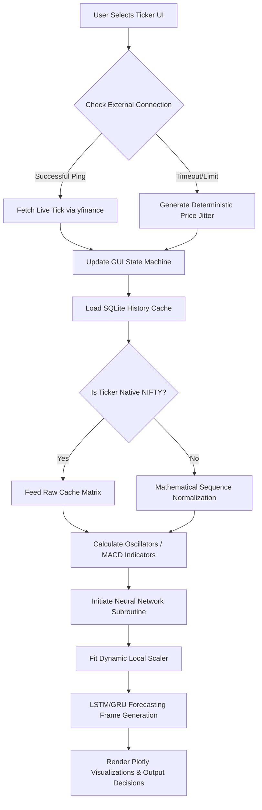

# NIFTY AI Stock Prediction Dashboard - Presentation Content

This document contains structured content mapped to typical PowerPoint slide layouts to help you create your presentation quickly.

---

## Slide 1: Title Slide
**Title:** NIFTY AI Stock Prediction Dashboard
**Subtitle:** A High-Availability, Dual-Interface Forecasting Framework
**Presenter Name/Details:** [Your Name / Team Name]
**Domain:** Machine Learning & Financial Technology

---

## Slide 2: Abstract & Problem Statement
**Title:** Project Vision & Abstract
**Bullet Points:**
- **Objective:** Evaluate financial market trends through machine learning without relying heavily on volatile external APIs.
- **Challenge:** Conventional stock predictors fail when APIs rate-limit or go offline, breaking the real-time interaction.
- **Solution:** A hybrid data pipeline bridging a static offline SQLite historical database with intermittent real-time live tickers.
- **Technologies:** Advanced Deep Learning (LSTM, GRU) combined with technical indicators (RSI, Volatility) and Mathematical Surrogates (ARIMA, Prophet).

---

## Slide 3: Core Features
**Title:** Key Features of the System
**Bullet Points:**
- **100% Offline Stability:** Local SQLite cache (`nifty_history.db`) acts as a highly resilient data layer if API fails.
- **Dual Frontends:** 
  - Rich interactive Streamlit Dashboard (`app.py`).
  - Web Native Static Dashboard (`index.html` + `script.js`) backed by a asynchronous Flask API (`api.py`).
- **Dynamic AI Integrations:** Neural Network models dynamically scale independently of asset scale using "on-the-fly" MinMaxScalers.
- **Robust Metrics Analyzer:** Real-time computation of directional signals, moving averages, RSI, and MACD indicators seamlessly without dataframe crashes.

---

## Slide 4: System Architecture
*(Tip: You can use a flowchart diagram on this slide)*
**Title:** High-Level Data Flow

**Mermaid Flowchart Diagram:**

**Flow Explanation:**
1. **User Action:** Selects a Stock Ticker.
2. **Ping External API / Fallback:** Checks live connection; falls back to offline deterministic jitters if API times out.
3. **Data Sourcing:** Historical matrices loaded from local SQLite cache.
4. **Machine Learning Pipeline:** Normalization, Oscillator calculation, and ML subroutines executed.
5. **Output Rendering:** GUI updates with Plotly rendering.

---

## Slide 5: Components Deep Dive
**Title:** 4-Pillar System Implementation
**Bullet Points:**
1. **Data Engineering Backend (`data_fetch.py`):** Uses mathematical scale transformers to mock smaller stocks using NIFTY 50 baseline data when offline.
2. **Real-time API Bridging (`data_fetch.py`):** 3-second liveline hook catching network exceptions effortlessly.
3. **Machine Learning Core (`model.py`):** Deploys pre-trained Keras weights (`.keras`) fitting dynamically on 60-day historical window arrays.
4. **Dual Presentation (`app.py` / `api.py`):** Multi-platform flexibility ensuring ease of use for Data Scientists and Web Devs alike.

---

## Slide 6: The Algorithmic Approach
*(Tip: Briefly explain how the predictions are derived without deep code)*
**Title:** Prediction Subroutine Loop
**Bullet Points:**
- **Step 1:** Fit a dynamic scaler purely on the requested stock subset.
- **Step 2:** Load locally cached, computationally heavy Neural Network matrices (`lstm_model.keras` / `gru_model.keras`).
- **Step 3:** Process & Transform the last 60 days of closing sequences.
- **Step 4:** Output predictions and inverse-transform back to real currency bounds.
- **Observation:** This decouples heavy computations from internet latency. 

---

## Slide 7: Technical Stack Summary
**Title:** Technology Stack
**Grid/List format:**
- **Languages:** Python, JavaScript, HTML/CSS
- **ML & Data Processing:** TensorFlow (Keras), Scikit-learn, Pandas, NumPy
- **Backend & APIs:** Flask, Yahoo Finance API (`yfinance`), SQLite
- **Frontend / UI:** Streamlit (Python UI), Plotly (Interactive Charting), Bootstrap/Vanilla JS
- **Deployment:** Docker & Docker Compose configured (`Dockerfile`, `docker-compose.yml`)

---

## Slide 8: Future Enhancements & Conclusion
**Title:** Conclusion
**Bullet Points:**
- **Summary:** Successfully built a highly-resilient, crash-proof analytical dashboard simulating high-frequency trading behaviors purely from memory caches.
- **Future Enhancements:** 
  - Extend offline database to cover Mid-Cap and Small-Cap indices.
  - Implement dynamic news sentiment scraping using NLP.
  - Establish custom user portfolios and backend authentication.

---
**Note to Presenter:** For visuals, I highly recommend adding screenshots from the Streamlit UI and the Web Native UI (index.html), along with a visual representation of a plotted candlestick chart.
